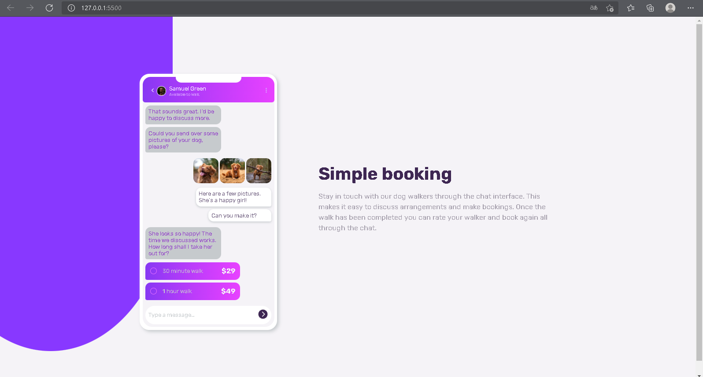
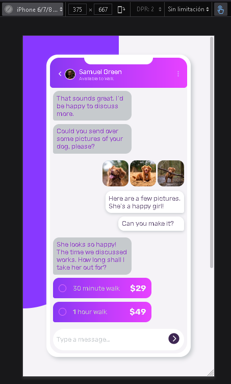
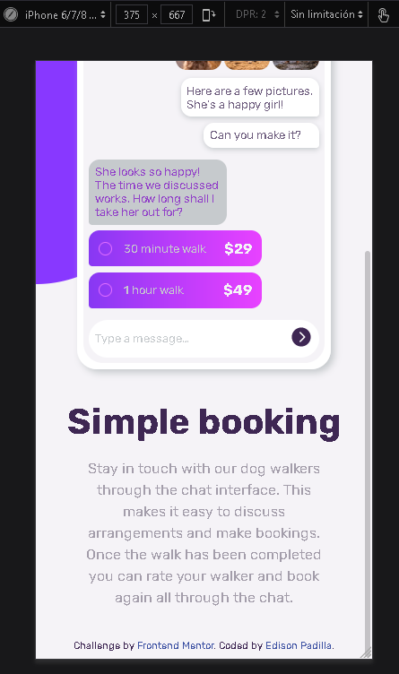

# Frontend Mentor - Chat app CSS illustration solution

This is a solution to the [Chat app CSS illustration challenge on Frontend Mentor](https://www.frontendmentor.io/challenges/chat-app-css-illustration-O5auMkFqY). Frontend Mentor challenges help you improve your coding skills by building realistic projects.

## Table of contents

- [Overview](#overview)
  - [The challenge](#the-challenge)
  - [Screenshot](#screenshot)
  - [Links](#links)
- [My process](#my-process)
  - [Built with](#built-with)
  - [Continued development](#continued-development)
- [Author](#author)

## Overview

### The challenge

Users should be able to:

- View the optimal layout for the component depending on their device's screen size

### Screenshot

### Links

- Solution URL: [solution](https://github.com/EdisonPadilla/Chat-app-CSS-illustration-.git)
- Live Site URL: [live site (github page)](https://edisonpadilla.github.io/Chat-app-CSS-illustration-/)

## My process

### Built with

- Semantic HTML5 markup
- CSS custom properties
- Flexbox
- CSS Grid
- Ionicons: [Ionicons](https://ionicons.com/)
- Google Fonts: [Google Fonts](https://fonts.google.com/)

### Continued development

- I will work in the future on the: bonus; see the chat interface animate on the initial load.

## Author

- Frontend Mentor - [@Evanny](https://www.frontendmentor.io/profile/Evanny)
